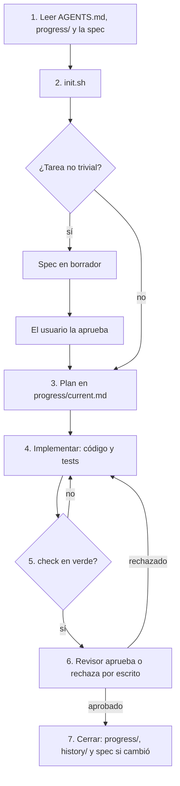

# agent-harness

Entorno que rodea al modelo para que trabaje de forma confiable. Sirve con **Cursor CLI**, **OpenCode** y **Muse**, lanzados desde **Orca**.

El modelo no se acuerda de una sesión a la otra y puede afirmar que terminó sin haberlo comprobado. Este repo le deja instrucciones, roles, memoria en archivos y un chequeo que sale distinto de cero si algo falla. El texto orienta; el código obliga.

## Qué ofrece

Cuatro piezas, las mismas en cualquier proyecto:

| Pieza | Qué es | Dónde vive |
|---|---|---|
| **Contexto** | Instrucciones que el agente lee antes de tocar código | `AGENTS.md` de cada proyecto, `instructions/`, `agents/` |
| **Herramientas** | Skills que puede ejecutar | `skills/` (se instalan en `~/.agents/skills/`) |
| **Memoria** | Estado fuera del chat | `progress/` por worktree, `specs/` en git, engram como índice |
| **Verificación** | Comprobación ejecutable | `npm run check` o `make check`, más CI en las plantillas |

Además trae:

- **Roles.** Líder, implementador, revisor y explorador. Especialistas de seguridad y testing, solo cuando la tarea lo justifica.
- **Skills.** `write-spec` (redactar una spec), `verify-check` (correr el chequeo completo), `check-map` (rutas sensibles), `crear-issue` (abrir un issue de GitHub con confirmación) y `update-progress` (dejar la tarea escrita).
- **Plantillas de proyecto** que ya cumplen el contrato: Next.js (`template/`), Python (`template-python/`) y MERN (`template-mern/`). Cada una incluye `AGENTS.md`, `init.sh`, `progress/`, `specs/` y un workflow de CI que corre `check`.
- **Instalador** estilo dotfiles (`install.sh`): idempotente, con `--dry-run` y backup de lo que ya exista.

Principios:

- **Simple primero.** Pocas piezas y bien elegidas.
- **Demostrar, no afirmar.** Nada está terminado sin `check` en verde y aprobación escrita del revisor.
- **Contexto chico.** El estado va a archivos. El líder delega para no inflar su contexto.
- **Portable.** `AGENTS.md` y `~/.agents/skills/` los leen los tres agentes.

## Cómo funciona

Hay dos capas.

**Este repo es el cómo.** Roles, skills, plantilla de spec y estándares que valen en todos los proyectos. Un implementador recibe el *qué* del líder de la tarea y cumple el *cómo* de estos estándares (`docs/matrix.md`).

**Cada proyecto es el qué.** Alcance, plan y decisión de entrega viven en ese repo: `progress/`, `specs/` y el `AGENTS.md` propio. Orca abre un worktree por tarea; el líder de ese worktree no ve el `progress/` de otro hasta el merge.

La fuente de verdad son los archivos en git. [Engram](instructions/global.md) indexa decisiones y specs para recuperarlas entre sesiones (`mem_search`, `mem_save`). Si el chat se compacta, el estado se reconstruye desde `progress/current.md` más engram, no desde la memoria de la conversación.

## Flujo de una tarea

Así se trabaja cualquier proyecto del harness. El detalle está en `instructions/workflow.md`.



1. **Leer.** `AGENTS.md` del proyecto, `progress/` del worktree y la spec si la tarea la tiene.
2. **Entorno.** Correr `init.sh`. Si falla, no se empieza: se arregla el entorno primero.
3. **Spec, solo si no es trivial.** Feature nueva, endpoint, migración, cambio de comportamiento visible, auth, pagos o datos sensibles. El líder redacta con `write-spec` (`Estado: borrador`) y **el usuario aprueba** (`Estado: aprobada`). Un bug de un archivo, un cambio de texto o un refactor sin cambio de comportamiento no lleva spec. Ante la duda, se escribe. Ver `docs/specs.md`.
4. **Implementar.** Una tarea a la vez. Tests que prueban comportamiento real (fallarían si el código estuviera mal).
5. **Verificar.** Skill `verify-check`: `npm run check` o `make check`, completo. En rojo, la tarea no está terminada.
6. **Revisar.** El revisor corre el chequeo él mismo y deja el veredicto en `progress/` (`agents/reviewer.md`). Si la tarea toca auth, secretos, pagos, datos sensibles o dependencias nuevas, también interviene el revisor de seguridad. Si hay lógica con ramas o casos borde, el de testing. Un rechazo de especialista no se saltea (`docs/matrix.md`).
7. **Cerrar.** Actualizar `progress/current.md`, copiar un snapshot a `progress/history/` y actualizar la spec en el mismo cambio si el comportamiento cambió.

Definición de terminado:

- Criterios de aceptación cumplidos.
- `check` en verde.
- Tests nuevos de comportamiento real.
- Revisor aprobó por escrito en `progress/`.
- `progress/` con el resumen del cambio.
- Spec actualizada si algo cambió.

El líder hace inline solo lo atómico (leer pocos archivos para decidir, un archivo mecánico, definir alcance). Explorar mucho, escribir lógica o correr `check` se delega. Más de ~400 líneas o más de una unidad de entrega se parte en slices: cada slice recorre implementar, verificar y revisar por separado.

## Roles

| Rol | Hace | No hace |
|---|---|---|
| **Líder** | Alcance, plan, delegación, decisión de entrega | Implementar una feature de varios archivos ni dar por terminado sin `check` y revisión |
| **Implementador** | Código y tests del plan | Salirse del alcance; push o deploy sin que se lo pidan |
| **Revisor** | Chequeos, spec, convenciones; veredicto escrito | Exigir trabajo fuera de la tarea (eso queda como issue aparte) |
| **Explorador** | Investiga y reporta | Modificar código, docs o `progress/` |
| **Seguridad / testing** | Restricción dura en su área | Activarse en tareas que no los necesitan |

Los prompts están en `agents/`. Por defecto alcanza líder + implementador + revisor general.

## Contrato de cada proyecto

Todo proyecto del harness cumple esto:

| Elemento | Requisito |
|---|---|
| `AGENTS.md` | En la raíz del repo |
| `npm run check` o `make check` | Lint + typecheck + tests (en MERN: lint, tests, build y e2e). Sale distinto de cero si algo falla |
| `init.sh` | Deja el entorno listo o explica qué falta |
| `progress/` | Sigue `docs/progress-format.md`. `current.md` es lo último; `history/` guarda hitos |
| `specs/` | Una spec por feature no trivial, actualizada en el mismo cambio (`docs/specs.md`) |
| `docs/mapa-agentes.json` | Rutas sensibles. El revisor corre `check-map` (`docs/mapa.md`) |
| Engram | Decisiones y specs indexadas. Los archivos mandan; engram recupera |

Las tres plantillas ya traen ese esqueleto y un ejemplo mínimo para copiar como base de un proyecto nuevo.

| Plantilla | Chequeo | Stack del ejemplo |
|---|---|---|
| `template/` | `npm run check` | Next.js, ESLint, TypeScript, Vitest, Playwright |
| `template-python/` | `make check` | ruff, mypy, pytest |
| `template-mern/` | `npm run check` | Express + Vite/React (workspaces), ESLint, Vitest, supertest, Playwright. Sin Mongo: el cableado se agrega por proyecto |

## Estructura de este repo

```text
agent-harness/
├── README.md                  # Esta guía
├── AGENTS.md                  # Reglas para agentes que modifican el harness
├── instructions/              # Flujo, estilo e instrucciones globales
├── agents/                    # Líder, implementador, revisor, explorador
│   └── specialists/           # Seguridad y testing
├── skills/                    # write-spec, verify-check, check-map, crear-issue, update-progress
├── specs/spec-template.md     # Plantilla de spec
├── docs/                      # orca, specs, matrix, mapa, formato de progress
├── template/                  # Plantilla Next.js
├── template-python/           # Plantilla Python
├── template-mern/             # Plantilla MERN
└── install.sh                 # Symlinks idempotentes, con backup y --dry-run
```

## Instalación

En una máquina nueva:

```bash
git clone git@github.com:Juarex9/agent-harness.git
cd agent-harness
./install.sh --dry-run   # primero: mirá qué haría, no cambia nada
./install.sh             # después: crea los symlinks (con backup de lo existente)
```

Qué configura por agente (solo rutas verificadas en documentación oficial):

| Origen (este repo) | Cursor CLI | OpenCode | Muse |
|---|---|---|---|
| `agents/*.md` | `~/.cursor/agents/` | `~/.config/opencode/agents/` | Sin directorio global documentado: el líder los usa como texto del encargo al subagente |
| `skills/*` | `~/.agents/skills/` | `~/.agents/skills/` | `~/.agents/skills/` |
| `instructions/global.md` | Manual: User Rules en Customize (sin ruta de archivo documentada) | Symlink a `~/.config/opencode/AGENTS.md` | Manual: user rules de la app |

Pasos manuales después de `install.sh` (ver `docs/orca.md`):

1. Cursor: copiar `instructions/global.md` como User Rules en Customize → Rules.
2. Muse: revisar `settings.json` (MCP, hooks) sin pisar lo existente.
3. Orca: MCP compartidos, hooks de worktree, skills con `npx skills add`, y la propuesta de permisos seguros.

Correr `install.sh` dos veces no cambia nada la segunda vez. Si un destino ya existe y no es el symlink correcto, lo mueve a `<destino>.bak-<fecha>` antes de enlazar.

## Uso con Orca

Orca lanza el CLI de cada agente en su worktree. El agente lee sus propios archivos; este repo no configura Orca por script (no hay una forma soportada de hacerlo).

En Orca queda, documentado en `docs/orca.md`:

- MCP compartidos entre worktrees.
- Un hook al crear el worktree: instalar dependencias, copiar `.env` local (nunca commiteado) y correr `init.sh`.
- Skills de Orca (`orca-cli`, `orchestration`, `computer-use`).
- Permisos: lo reversible (leer, editar, tests) puede fluir; push, deploy y secretos piden confirmación. El worktree no es la única defensa.

## Estado de fases

- [x] Fase 1: investigación (Cursor CLI, OpenCode, Muse, Orca)
- [x] Fase 2: diseño (+ addendum de specs)
- [x] Fase 3: repo global (este)
- [ ] Fase 4: plantilla Next.js (`template/`)
- [ ] Fase 5: prueba real en proyecto de ejemplo
- [x] Fase 6: especialistas (seguridad, testing)
- [x] Fase 7: variantes Python y MERN

## Dónde seguir

| Si querés… | Leé |
|---|---|
| El paso a paso y cuándo delegar | `instructions/workflow.md` |
| Cómo escribo y qué no se toca | `instructions/style.md`, `instructions/global.md` |
| Cuándo hace falta spec y quién la aprueba | `docs/specs.md` |
| El formato de `progress/` | `docs/progress-format.md` |
| Qué archivos no se tocan sin preguntar | `docs/mapa.md` |
| Cuándo activar especialistas | `docs/matrix.md` |
| Qué configurar en Orca | `docs/orca.md` |
| Copiar un proyecto nuevo | el `README.md` de `template/`, `template-python/` o `template-mern/` |
